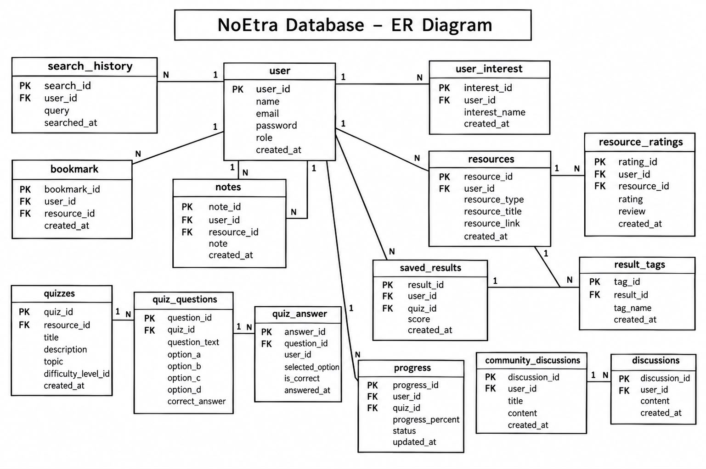

# NoEtra Database

This folder contains the database design and documentation for **NoEtra**.

NoEtra helps users search topics, generate roadmaps, access resources, take quizzes, save results, track progress, write notes, bookmark resources, manage interests, reset passwords, and participate in discussions.

---

## Database Overview

The NoEtra database uses a relational database model.

It stores information about:

- Users
- Search History
- Saved Results
- Learning Resources
- Bookmarks
- Tags
- User Interests
- Ratings
- Notes
- Progress
- Password Reset
- Quizzes
- Questions
- Quiz Results
- Difficulty Levels
- Discussions
- Community Discussions

---

## Database Technology

- MySQL / MariaDB
- Relational Database Management System (RDBMS)
- Primary Keys (PK)
- Foreign Keys (FK)
- One-to-Many (1:N)
- Many-to-Many (M:N)

---

## Database Structure

### 1. users

| Field | Description |
|---|---|
| user_id | Primary key |
| full_name | User's full name |
| username | Unique username |
| email | User email |
| password | Hashed password |
| role | Student or admin |
| created_at | Account creation date |

### 2. search_history

| Field | Description |
|---|---|
| search_id | Primary key |
| user_id | FK → users |
| topic_name | Searched topic |
| searched_at | Search date |

### 3. saved_results

| Field | Description |
|---|---|
| result_id | Primary key |
| user_id | FK → users |
| topic_name | Topic |
| roadmap | Generated roadmap |
| ai_notes | AI notes |
| created_at | Creation date |

### 4. resources

| Field | Description |
|---|---|
| resource_id | Primary key |
| result_id | FK → saved_results |
| resource_type | Resource type |
| resource_title | Resource title |
| resource_link | Resource URL |
| created_at | Creation date |

### 5. bookmarks

| Field | Description |
|---|---|
| bookmark_id | Primary key |
| user_id | FK → users |
| resource_id | FK → resources |
| created_at | Bookmark date |

### 6. tags

| Field | Description |
|---|---|
| tag_id | Primary key |
| tag_name | Unique tag name |

### 7. resource_tags

| Field | Description |
|---|---|
| resource_tag_id | Primary key |
| resource_id | FK → resources |
| tag_id | FK → tags |

### 8. user_interests

| Field | Description |
|---|---|
| interest_id | Primary key |
| user_id | FK → users |
| interest_name | Learning interest |

### 9. ratings

| Field | Description |
|---|---|
| rating_id | Primary key |
| user_id | FK → users |
| resource_id | FK → resources |
| rating | Rating value |
| review | User review |

### 10. notes

| Field | Description |
|---|---|
| note_id | Primary key |
| user_id | FK → users |
| topic_name | Related topic |
| note | Note content |

### 11. progress

| Field | Description |
|---|---|
| progress_id | Primary key |
| user_id | FK → users |
| resource_id | FK → resources |
| progress_percent | Completion percentage |
| status | Learning status |

### 12. password_reset

| Field | Description |
|---|---|
| reset_id | Primary key |
| user_id | FK → users |
| reset_token | Reset token |
| expires_at | Token expiration |
| used_at | Token usage time |

### 13. difficulty_levels

| Field | Description |
|---|---|
| level_id | Primary key |
| level_name | Difficulty level |
| description | Level description |

### 14. quizzes

| Field | Description |
|---|---|
| quiz_id | Primary key |
| result_id | FK → saved_results |
| difficulty_level_id | FK → difficulty_levels |
| title | Quiz title |
| topic | Quiz topic |

### 15. questions

| Field | Description |
|---|---|
| question_id | Primary key |
| quiz_id | FK → quizzes |
| question_text | Question |
| option_a–d | Answer options |
| correct_answer | Correct option |

### 16. quiz_results

| Field | Description |
|---|---|
| result_id | Primary key |
| user_id | FK → users |
| quiz_id | FK → quizzes |
| score | Obtained score |
| total_questions | Total questions |
| completed_at | Completion date |

### 17. discussions

| Field | Description |
|---|---|
| discussion_id | Primary key |
| user_id | FK → users |
| result_id | FK → saved_results |
| content | Discussion content |

### 18. community_discussions

| Field | Description |
|---|---|
| discussion_id | Primary key |
| user_id | FK → users |
| title | Discussion title |
| content | Discussion content |

---

Entity Relationship Diagram

The following ER diagram shows the tables, primary keys, foreign keys and relationships of the NoEtra database.

## Primary Keys and Foreign Keys

### Primary Keys (PK)

- `users.user_id`
- `search_history.search_id`
- `saved_results.result_id`
- `resources.resource_id`
- `bookmarks.bookmark_id`
- `tags.tag_id`
- `resource_tags.resource_tag_id`
- `user_interests.interest_id`
- `ratings.rating_id`
- `notes.note_id`
- `progress.progress_id`
- `password_reset.reset_id`
- `difficulty_levels.level_id`
- `quizzes.quiz_id`
- `questions.question_id`
- `quiz_results.result_id`
- `discussions.discussion_id`
- `community_discussions.discussion_id`

### Foreign Keys (FK)

- `search_history.user_id → users.user_id`
- `saved_results.user_id → users.user_id`
- `resources.result_id → saved_results.result_id`
- `bookmarks.user_id → users.user_id`
- `bookmarks.resource_id → resources.resource_id`
- `resource_tags.resource_id → resources.resource_id`
- `resource_tags.tag_id → tags.tag_id`
- `user_interests.user_id → users.user_id`
- `ratings.user_id → users.user_id`
- `ratings.resource_id → resources.resource_id`
- `notes.user_id → users.user_id`
- `progress.user_id → users.user_id`
- `progress.resource_id → resources.resource_id`
- `password_reset.user_id → users.user_id`
- `quizzes.result_id → saved_results.result_id`
- `quizzes.difficulty_level_id → difficulty_levels.level_id`
- `questions.quiz_id → quizzes.quiz_id`
- `quiz_results.user_id → users.user_id`
- `quiz_results.quiz_id → quizzes.quiz_id`
- `discussions.user_id → users.user_id`
- `discussions.result_id → saved_results.result_id`
- `community_discussions.user_id → users.user_id`

---

## Table Relationships

| Parent | Child | Relationship |
|---|---|---|
| users | search_history | 1:N |
| users | saved_results | 1:N |
| saved_results | resources | 1:N |
| users | bookmarks | 1:N |
| resources | bookmarks | 1:N |
| resources | resource_tags | 1:N |
| tags | resource_tags | 1:N |
| users | user_interests | 1:N |
| users | ratings | 1:N |
| resources | ratings | 1:N |
| users | notes | 1:N |
| users | progress | 1:N |
| resources | progress | 1:N |
| users | password_reset | 1:N |
| saved_results | quizzes | 1:N |
| difficulty_levels | quizzes | 1:N |
| quizzes | questions | 1:N |
| users | quiz_results | 1:N |
| quizzes | quiz_results | 1:N |
| users | discussions | 1:N |
| saved_results | discussions | 1:N |
| users | community_discussions | 1:N |

---

## Features Supported

- User Registration & Login
- User Profile
- Topic Search & Search History
- Learning Roadmap
- Saved Results
- Learning Resources
- Bookmark Resources
- Resource Tags
- User Interests
- Ratings & Reviews
- Personal Notes
- Progress Tracking
- Password Reset
- Practice Quizzes
- Quiz Results
- Community Discussions
- Admin Management

---

[def]: Erdiagram.png.jpeg